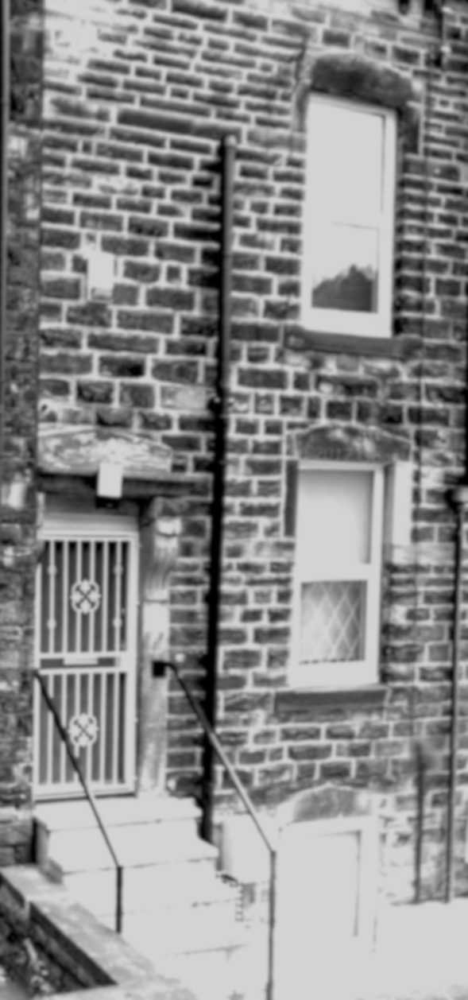
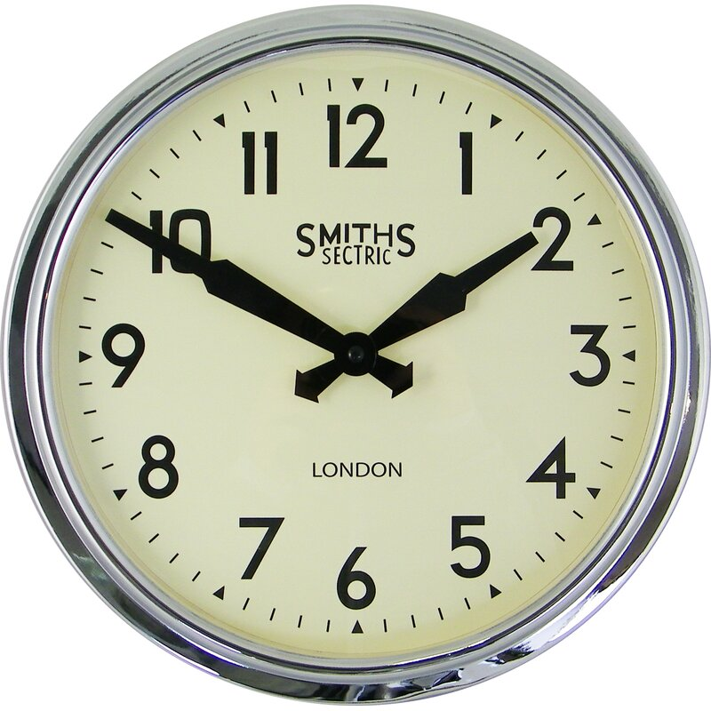
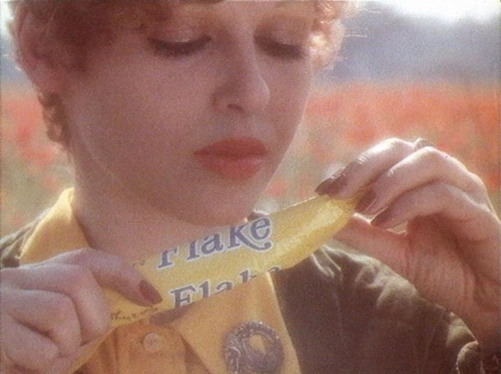
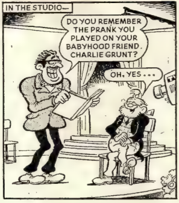

Wind on my face, close all around. Eyes towards the evening sun. A
beautiful girl\'s face offers the word angel. Full fleshy lipped girl
face, obscene female greed exuded like atmospheric puss from sick
misprint word suction of 'I want fuck, I want in me, I want eat you' --
nasty.

Michael Scott, an animals' astronaut in space, right here now. Where's
the party? The battle of staying within these things this stuff (another
cigarette - habits keep coming back for more.)

Today, 4 May 1975, I had all words reduced, mixing on the table but
slipping off. Heart inside my body beating fast, trembling greed more,
only trembling mouth greed. \'You are inside me, I am eating you from
the inside, I eat arse to mouth\'. DK laughs shameless, \'I only do my
job\'. We despair -- WHY?

\'Smmph\', soft breathed laugh. It has been said before, old words and not
my own, echo of dead gone on ahead. I await my turn, I await my return.

All going through decay. Fear and confusion. What to do at home at
Christmas. There is no hope, \'no hope, no hope at all\' -- I copy out
William Burroughs, in this my own way, the only way. Good night.

Four girls falling at a fantastic speed of one hundred and twenty miles
per hour towards the earth. The kind of girl I can find around the
corner. The night before they think about the time the floor will fall
out.

Standing at the edge of the swimming pool, I wait. The Worker sweeps the
dust across the dark floor of a small room. \'Take your hands out of your
pockets! We didn\'t come here to sit around, we\'ve come to work\'.

Hands that do dishes -- a young man, a shadow of his former self, looks
sadly out from behind the cafe counter -- broken -- inhuman acts are
going on there in the city. Who made the machine? How did the dinosaur
die? I can\'t remember, a long time ago. There was food and water, but
the thousands of people aboard made distribution difficult. A decision
will be announced tomorrow.

Swiftly sharply the tension mounted -- until suddenly it was snapped by
an anonymous phone call. The telephone rang continuously in the dark
office, then stopped. Someone at the other end of the line said, \'No one
there\'. The line went dead. I awoke the next morning with a feeling that
something was happening, but what it was I can\'t be certain. My name is
M. T. Fiction, I just fill in the details. I must go, I perhaps have an
appointment.

The Manager with a cigarette tight between his fingers, \'Come on lad,
Play The Game!\' He wants me in on time. Mr Smiths Sectric knows what
time it is. Just look at his face steady and certain. Take a motion
picture of his face, hang it on every wall. Mr Smiths is telling you
it's time. Time to work. \'Use your hands lad!\' The Worker sweeps dust of
time across the factory floor, time the floor will fall out.

\'Let\'s get things moving\' across the factory floor. Mister Smiths says
cold and certain -- \'for my first trick\...\' -- I never heard what he
said his second trick was. Played before I could catch my breath. You
pick up the cards and play them as your own. I throw my hand in. Come on
lad play the game! I make no reply. All eyes turn my way. Why did you
come? I smile. I have been asking the same question myself. \'Come on
this is the last hand, then we\'ll go home -- are you in?

Ok. I can see nothing else to do. What did I do before? Before what? My
nerves tremble faster inside my flesh as I catch a glimpse of Mr Smiths
first trick. Worker mixes the cards and shifts them across the table. I
pick up my hand and pretend to play the game -- \'one must pretend an
interest\' -- the words of the man in front echo back on the winds of
time.

I smile sadly to myself, old words and not my own Flash Harry knows that
smile. He\'s never felt it himself, but he makes it happen often enough.
He explains:

\'We are only doing our job -- nothing personal you understand. We\'ve
got to eat like everyone else. All of us have got to eat -- we\'re under
contract to keep things moving -- some times we catch a big fish and
other times only a small one. You\'re a small fish, so we\'re going to
use you to try and catch a big'un. You understand? Nothing personal,
like the bomb at Hiroshima. No one wants the atomic bomb, but we\'ve got
to have it because they have it. You understand? We\'ve all got to keep
fishing, right?\'

He turns to his silent partner -- the strong silent type, you know the
kind, cold and certain. The sheep dog darts round the flock, picking up
orders from the whistling winds of time.

I stand waiting by the edge of the swimming pool, remembering a young
boy on a bicycle in the country lanes near the Maze racecourse. (It's
only a small track -- Mike says you can make a killing there, if you
know the horses.) Looking out over the fields to the internment camp
thinking, 'we lock each other up'. Obvious but true. Then shifting
images, a long time ago, to the rugby pitch where I leant against the
post and wouldn\'t play -- \'lazy fucker\'.

\'Come on lad play the game. Take your hands out of your pockets\' -- I go
through the motions but my heart just isn\'t in it. What I\'m trying to
say is we\'re in the removal business, any place all the time, but yet
we never have to leave the Factory. It\'s a family business you
understand. We keep to ourselves. Stick with us, lad. Give us good
service, make yourself useful and we\'ll pay you well I promise -- Now
get back to work and wait your turn. He closed the office door

My body is laid out on the factory roof in the sun, wind and dust over
my stomach. Ninty-three million mile touch sunlight warms the air like
liquid over my closed eyelids, shining through, illuminating a flesh
screen, colours we all know if we look. Distance becomes a matter of
preference. Ideas shift slowly in the background no longer pushed for
time. Now just what was I think ing a moment ago? Sahara of shifting
yellow light, my body fades out to the side lines, waiting on the touch
line, lying on the floor. Breath in, breath out again, again. Dirt falls
against my eye and it jerks tighter. I must be on automatic pilot I
amuse myself thinking. This body, I am Charlie Grunt to his friends and
enemies alike.

In the Studio: \'Do you remember the prank you played on your Babyhood
friend Charlie Grunt?\' The compere asks with a smile (you have to admit
it's all bloody funny) \'Oh, yes\...\' replies the innocent old man with a
smile. \'I made him responsible -- left him sitting in the driver\'s
seat. Well after all he did have the manual. I had other things to do. I
was quite happy to watch the miles flash by. I didn\'t want to be
bothered with all that gear changing and technical details. Of course, I
had to help him out with the tricky decisions. All those crossroads in
the Sahara -- "which way?" he\'d shout, glancing back at me in the
rearview mirror, adding in a strangely menacing manner, "we\'re running
low on fuel". "That way," I say pointing in the most likely direction.
God only knows it was tricky deciding sometimes. The maps were old and
not my own. Picked them up various places, off friends, some I just
found lying there in the road, left by people gone in front, I believe.
We always seemed to make it somehow, up to now that is. Still it used to
piss me off sometimes. "Charlie can we not make this thing self
sufficient?" He\'d just grunt "no way". I could see his point. "Can we
not just get out then and walk". He\'d grunt again, "Doors are locked!"
He was like that, Charlie, a man of few words. Basic I\'d call it. There
was no arguing with him, though it took me some time to realise it.
We\'d have some stupid rows sometimes. I\'d complain about his driving,
or that we weren\'t going fast enough. "Faster Charlie FASTER!" I\'d
yell from the back seat, jumping up and down with excitement. "Let\'s
get THERE!" I\'d scream in his ear like I was talking about something I
couldn\'t quite put into words. I doubt if he understood but he\'d grunt
all the same and put his foot to the floor, and there I\'d be waving out
the window, jumping into the front seat even sometimes. Charlie liked
that, I could see him attempt a grin through the strain, but after a bit
he could never keep it up, he would be shaking and sweating fit to
burst. His eyes would go crazy, looking all ways confused. His hands
would slip on the wheel. We\'d start swerving all over the road. "I
can\'t hold it we\'re breaking up we\'ve got to STOP. She won't take any
more. She\'s not built for it!"\'

\'Now Charlie loved that car. It was his baby, his life. Without that car
he would be nothing, and he knew it. His whole being was solely occupied
with driving it, and repairing it. He tried to keep it running as smooth
as he was able, which was a tricky job sometimes, considering what tools
he had, if you know what I mean. Still, all the same, basic as he was,
he was quite a handyman when it came to the crunch. Never failed me yet,
and we\'ve had a crunch or two. Well I mean you\'re bound to driving on
roads like these.\'

\'The wind blows colder across our bodywork. The heater\'s jammed at a
steady ninety-eight point something or other, so I say, "lets go see
what's happening that way" and we turn off the open road and head back
to civilisation once again.\'

I get the feeling I\'m leaving a lot out as I go along. Looking back I
saw it could\'ve been better. Everything sprinkled with flaws and
omissions like dust. Brand name 'IMPERFECT', just to annoy you. \'I want
to see the manager\'. 'I\'m sorry he\'s not in at present\'. 'He never
is'. The telephone rang continuously in the dark office, at the other
end someone said \'no one in, the floor must have fallen out\'. Space
opens up under my feet worlds fall away. Goodbye Charlie. All channels
shutting down, zeroing in. All voices mumble across each other, bones
turning brittle, flesh drying, turning to dust on the factory floor. The
worker sweeps us into another pile. \'I want to see the manager\'. \'I\'m
sorry he\'s not in at present\'. \'He never is\'. I cursed for many
millions of years. Now as I turned to go, \'What is it you want? Perhaps
I can help\', the secretary asked politely. I stoped at the door but
without much hope. That politeness masked an indifference so vast that
it made you want to leave the room at times. Looking into her eyes I
could see quite plainly I wasn\'t there. A strange feeling, like the
floor falling away. \'Are you ok?\', she asked, peering into me. \'Ok\', I
smiled noncommittally. She wouldn\'t know what I was feeling anyway.
Made it happen many a time but never felt it herself. \'Who covered the
factory with this IMPERFECT stuff?\' \'Oh that, I hardly notice it. Don\'t
really mind it, you know. Just one of those things sent to try us\'
--sigh. \'Yes but who did it?\'. \'It was a mistake really. Some old
teacher\'s idea, said it was just the thing to keep the pests under
control. It certainly got rid of those nasty dinosaurs\'. \'How did the
dinosaur die?\' \'You ask so many questions, too many. You\'d better get
back to work before the manager catches you -- he'll give you your cards
if he finds you here\'.

Delta p, delta q, divided by h -- that's the famous Uncertainty
Principle which Werner Heisenberg enunciated in 1927, whispered back
along the line through pissed one night in the Buck, Malham, England,
ahhh\... fished out of a book bought a long time ago and never read now
placed here to keep me talking until the cavalry comes. I continue --
\'By "position" we mean the distance q from a certain mark on a line, and
by "momentum" we mean the momentum p in the direction of that line. You
can\'t measure both at the same time, and the more accurately you measure
one of them the more you will ruin any previous knowledge you may have
had of the other one. The greek letter delta is often used to indicate
the uncertainty of any quantity; a careful analysis has shown that the
two uncertainties delta p and delta q are related so that their product
is never less than Plank\'s constant.\'

Call Mister Plank. Call Mister Plank. Call Mister Plank\... Fading echo
down the corridors of the human archive. Mister Plank appears amongst
the flicker, pages through the air, staring straight a head frozen like
a photograph, 1ooking from another time in black white and grey, a
shadow of his former self. Do you remember the shutter closing Mister
Plank, to send this shadow back along the line? 'No personal questions
please'. The archive attendant requests with a smooth silent voice then
slips back into the basement. Mister Plank hands me his speech, ready
squeezed out in printed words. 'You will not hear my voice' -- he says,
attempting meaning -- \'just the echo echo a long time ago, or was it
yesterday. It's funny how hello always becomes goodbye in time\'. I pick
up the sheets of paper left lying in the road and read: 'ENERGY STEPS --
Let us start by considering a simple oscillating system: a pendulum just
a weight on a string. If we pull the weight to one side it is raised
slightly and its potential energy is increased. We now let it go\...
(just an experiment in a laboratory you understand. Swish\... Switch out
the light when you leave.) It begins to move, energy move, converting
its potential energy into kinetic energy, which reaches a maximum as the
weight passes the lowest point. For the rest of that swing its kinetic
energy is once more converted into potential energy, until it is all
gone and the pendulum after an instant of rest starts on its downward
journey. If there were no friction the pendulum would keep swinging
indefinitely and although kinetic energy keeps changing into potential
energy, and back again, the sum of the two remains the same, the total
energy remains constant.\'

Now let me stop a second to say that here I am reading this, looking at
a page of white paper with marks on it, marks I convert into voice
thinking in my head, at least that where I think it is. Let us just say
the noise of delta p delta q and let it go at that. There I am
correction, here I am self, aligned along body position. You know the
one, a combination design for the animals astronaut, the best we could
manage under the circumstances, and I realise in the back seat I\'m
working on that idea again, the one that suggests that if I can realise
exactly all of what\'s going on on both sides of the face, then it\'s
all going to fade away, weak voices of the powers that be gasping
villains last words -- or --

Body shaking, fading from the groin up, pressure on the face like the
air is getting heavier. The smell of my own body like a bad reminder.
Vision slanting, blurring, position shifting. \'I am sitting on a
chair\'. Where is the chair? Suddenly aware of a shuddering surge
through the spine flipping me forward like closing a pen knife. The
memory of the noise appears to break my neck. Oh my god, the taste of
fear, electricity on the tongue, and down there in my hand a tattered
piece of paper like an old map -- I produce it now from out of the past,
kept for times like this -- a rough circle drawn by a shaking hand
beside the gas fire, divided in four, two pairs, one pair shaded and
labeled need/worry, the other labeled comfort/happy -- Let me
demonstrate: I sit back from the fire it is too hot, \'that\'s better
(sigh)\', but now I am getting colder, the heater's jammed at a steady
ninety-eight point something or other, never was very certain about
these things, left them to Charlie, he always seemed to manage up to now
at least. Move closer to the fire, need I say more. You can see the
difficulty inherent in the situation. Well I did anyway. It just came
over me strange, sudden panic sensation like falling off the chair. I
jerked my head back, worlds fell away beneath my feet, and I looked up,
grainy static light dissolved the ceiling in messages, bulletins back to
here, right here and now, whispered reminder, cold and certain, 'We must
take you back'.

I must confess thet at this point I lost all trace of dignity,
grovelling in front of distant galaxies, walk on part when the
gunfighter starts shooting up the town. \'PLEASE! Mister, I\'m too young
to die. I\'m sorry honest I never realised. PLEASE!\' Gun returns
smoothly to its holster, the tall vague figure walks off screen
silently. There I am left alone on the main street with the taste of
dust in my mouth, voices of all people I know mumbling he will come
again.

At this point I left the cinema, as simply as he had left me. \'Will call
again, habit keeps coming back for more. All this to and fro will wear
me out. I throw this paper out the window to blow back along the old
cliche winds of time.\'

Human archives are not for alien benefit, just attempting final
abracadabra to fade away the powers that be to the sound of villains
last words gasping last words as the floor falls away at a fantastic
speed of one hundred and twenty miles per hour. \'Let\'s just say delta p
delta q and let it go at that.\' I leave these words for you as they
appear through \'imperfect\' by flaws and omissions like spilt ink from a
leaky pen.

Let demonstrate the teacher\'s product -- walking along a street of this
present town, traders line the pavement, offering with an apologetic
\'we've got to eat like everyone else\'. Charlie suggests a Cadbury\'s
Flake, only the crumbliest flakiest chocolate tastes like chocolate
never tasted before. Now I will tell you straight that we like the
stuff. I know what I like, as cliche has it, and here in my pocket
against my very own right hand is the money to buy it, permission
granted from the manager to have this much. \'Ooh thats nice\'. There
waiting up ahead is The Sweet Shop, made to make your mouth water. And
here beside me is the teacher rising from the flicker of pages. 'Do you
really need it?' he asks with a wise old voice across the hills to
India. But no fooling Charlie with phrases as harsh as that. He
remembers well the last time and the time before and before\... He turns
his simple basic expression on me. \'PLEASE\' he grunts like a child.
Never grew up you know just grew old. The teacher watches in silence
waiting for the class to settle down, he never shouts. manages the class
with cool cutting words, proving stupidity with a quick gesture,
reminder of all things forgotten. Pissed off with the whole discussion,
after all if it\'s only a piece of chocolate what does it matter?
\'Whatever you like Charlie, if it keeps you quiet\' There it is in the
hand, crumbling chocolate for the sweet tooth. It is nice no doubt about
that but half way through Charlie is suggesting an other. NO NO NO
ENOUGH. Just keep your eyes on the road. 'Thats better', the teacher
looks pleased, putting his arm around my shoulder, almost leaning no me
(sometimes I wonder about his motives) and says 'You know you could be
such a good pupil if it weren\'t for that Charlie Grunt. It\'s a pity we
can\'t get rid of him but we've got to get you to school somehow don\'t
we?\' he chuckles softly to himself. 'You have to admit it\'s bloody
funny. All the same lad'. His expression suddenly flickered through
pages to the stern old voice like he just remembered his job. \'You\'ve
got to be more firm, more certain, become responsible. Why do you give
in to HIM?\' His face acquired a look of disgust. \'That Charlie Grunt is
dirty. Have you ever really looked long and closely at his hands -- do
you know what they\'re used for? Ugh. Disgusting\'. He suddenly jumped up
and rushed through the office door, his mind filling with obscene
pictures, trying to remember where he left his flesh. You never know
who\'s for real these days. Drive on Charles.

Michael Scott, just a fiction writer and his chauffeur stroke handyman.
\'Call me Candide\' I sometimes say when I get the innocent mood upon me.
But that is just a step back along the list of characters as long as a
life time. Walk-on parts mostly, fitting into two opposite co-ordinates,
one each side of screen, back and front that is so that they superimpose
on each other. The director appears in the last frame as a man in the
street watching from across the road. \'Just stoped to watch the
accident\', he says on the mock TV news. Credits show to an empty cinema.
The floor falls out etc. I just sit here remembering the end. Throwing
pages out the window but not for alien benefit. Just siting outside the
door locked out without a key, trying Open Sesame to pass the time.
Outside men are going to the bookies and other places. This one passing
now has his arm in a sling and a blue biro held in between his teeth.
(That's what made me suggest bookies as a destination. Come back mister,
let\'s find out for sure, get the facts straight. Needless to say I
never opened my mouth. Just a gesture, you understand.) In this game you
got to learn not to listen too closely to yourself -- no final
abracadabra, just gestures out the window you understand.

Headline in bold black type: I\... I FEAR DEATH THROUGH THINKING. Young
fiction writer tells all: \'I watch and I think around the facts that I
see (even that fact, eyes on both sides of my face) I'm a fiction writer
you understand I have made it my job, what I like to call the invisible
job, I work through all stories plotting my course, the characters
appear from the flicker of pages. For reasons of convenience the thing
has been divided into parts pages chapters volumes. I can only work on
one page at once. Do you see what I\'m trying to say? The fiction is
constructed page after page, but always on the page your reading now,
this page. We have characters but they never all appear at once.
Locations change with the flicker of pages. Call Mister Plank to
explain: \'In classical mechanics the total energy can be freely chosen
(within reasonable limits) by releasing the pendulum from the
appropriate hight. BUT in quantum mechanics this is not so: the energy
of an oscillating system (like a pendulum -- like yes/no, good/bad,
hope/despair, happy/sad, need I say more) is \'quantised\', that is to say
it can only have certain discrete values separated by equal steps. The
magnitude of those energy steps is found by multiplying the frequency
(the number of oscillations per second) with a certain constant of
nature h=6.6 times 10\^-34 joule-sec. usually called Plank\'s constant.
Multiply your emotions by six point six times ten to the minus thirty
fourth to find the page size.

(I may not understand what I say but I say it anyway, address all
complaints to the manager, he will pass them on to the teacher.) And
here he is, \'you talk of things you do not understand, you make no
sense, you will only find yourself more and more confused!' Fair point
sir but I never opened my mouth, just a gesture you understand. At this
point the reporter breaks in, \'Mr Scott perhaps you would like to
explain more clearly what you mean by I FEAR DEATH THROUGH THINKING\'. Ok
I shall try again. Let me take you back to last night. I should take you
back further but I'm only human and as such am having sufficient
difficulty reversing this distance. Enough, I digress. Last night I am
lying stoned, that is drugs in the brain, it alters the size of the page
and print quite often. We're running three columns at once. That\'s a lot
of characters and in this limited space things can get out of hand,
carried away, just think of it as a party, a student party. Lying on the
bed facing in the direction of sleep. Eyes closed (I take you back to a
similar page in Fear and Confusion at Home at Christmas: \'you wouldn\'t
believe it my eyes starting words voices echoing down inside I can\'t
hear drifting round and round stop\... stop\...stop\... (it has been
said that immediate memory is recorded on a seven second tape loop
apparatus) my eyes tight shut but it's still not dark enough still not
black and only black far out past everywhere, floating in nothing, dead
upside down, or am I the right way upside down. If I could hold these
flashes, tiny specks of colour left over from a day\'s looking at things
-- grainy static appears the programme's over that's all for today \...
goodnight\... goodbye\... cracklewhine crackle\... -- hold them tight
with my eyes BUT they are my eyes. My eyes are what they tell me. Me the
edge of the photograph, the edge of the screen. Mr East, a teacher in a
stern face-the-fact voice has already said, \'YOU are dying Michael.
DYING. D--Y--I--N--G. Do you remember that word first seen grovelling in
front of distant galaxies on the ceiling. He said he would come again,
remember. His threat is the only law. He is waiting in the wings right
now'. Charlie turns to me \'I have a bad feeling, like falling off a
chair, like the floor\'s falling away. OPEN YOUR EYES!\' Charlie why do
you care? Mr East says there is no need to worry? But he isn\'t
listening. I smell his sweat thick and desperate. \'Now understand that
all these characters appear on the same page, it is a fiction that I am
writing. I watch and write around the facts that I see. I am thinking
you see. I turn to the next page, clean and white, innocent you might
say, and write in bold black type THIS COULD BE THE LAST PAGE (author\'s
note: This book shapes itself cutting in previous pages to continue the
story. I colour the details.)

I continue: the party was now beginning to get out of hand. I, being the
host, adopted a worried expression becoming convinced that the place was
going to be wrecked. Mr East appears from the crowd and intimated the
great meaningless. \'Don\'t worry man, it's groovy\... gwrooovie\'. As
usual he wears a youthful expression to parties. Starry eyed, if you
know what I mean. Charlie appears sick, though you wouldn't think so to
look at him, but he grunts and moans in a despairing murmur, \'I got the
fear\' in his usual manner. It's at times like these you see your
acquaintances in their true light, not altogether a pleasant experience.
Look closely and you'll see his every nerve tremble, itching with
nervous habit. Each cell of flesh biting its nails. I look over to the
door and catch a glimpse of the shadowy figure of the manager enter,
picking his way round the room with evident disgust until he's standing
right behind me, carefully out of sight. If I turn round I know he
won\'t be there -- slipped out the back leaving Flash Harry to pass on
the message. To prove my point I turn round. (I do this for you.
Gesturing out the window is the best gesture I can think to make.) Flash
Harry always stands close to you when he talks. He does it to intimidate
and usually it works. He likes the feeling. Ask William Burroughs about
white junk, he will tell you better than I. His face fills the whole
screen as he breaks into your space. His mouth opens to deliver the
manager's message, subtly spliced in with Harry's human touches:

\'This is no way for a man to live / I\'ll get you a better place / It's
wrong look at the mess / I understand though, I used to live like this
myself once have your fling when your young that\'s what I say but / you
are going to have to change your ways / I can see you are intelligent I
wish I had had your education why don't you use it settle down make
something of yourself / you are nothing you are wasting your time you
are wrong I am right / think of the future your parents they love you
You don\'t want to disappoint them now do you? They are worried about
you we are all worried we care about you you know. Yes does that
surprise you? We are concerned about you / we have our eyes on you /
Tell us what you want we can\'t understand what it is you are after /
you can not have it we will prevent you / if your not careful you\'ll go
crazy you know / soon maybe tomorrow maybe today maybe now you will be
mad we will not listen to you you will be mad / there is not much time
believe me I say this as a friend / we laugh at you already / you don\'t
want to be laughed at now do you? / PLAY THE GAME, LAD\'.

At this point the teacher returns promising bliss. \'Don\'t listen to them
man, their voices are no more than the whining of a spoilt child who
can\'t bear to have anyone not jealous of his toys. Just stupid empty
bullies. Think instead of the wind on your face close -- all around --
eyes half closed towards the evening sun, over the hills to India,
China, the huge silence of the Sahara -- and be amazed simply amazed\'.
Charlie in his usual state of concern butts in, \'I hate to have to
remind you boss especially when your getting kinda poetic BUT these guys
have got influence one hell of a lot of influence. They know how to get
you where it hurts\'. He shudders visibly, sweating through every pore.
\'We\'ve got plans boss, you and I, we\'ve got things to do. Pretend an
interest or they won\'t let us be. I tell you boss they\'ve got
influence\'. The manager has the final word. \'I warn you we are right, we
will not tolerate your insults, your insinuations about the reasons for
our conduct, the way we run this place is right. IT IS THE ONLY WAY. You
may not like it but that's the way it is. WE'VE GOT TO EAT LIKE EVERYONE
ELSE. I warn you if you persist in this prying into things that don\'t
concern you we will be forced to take steps to render you harmless. You
get my meaning. You are a menace to society (author\'s note: these last
three words were actually used to describe me by my old headmaster when
he explained to me why I had to get my hair cut. I attempted to run away
from home after for the second time after that meeting. I came back
because homesickness tore my heart asunder so that I didn\'t know where
to turn, where to go. By the way my hair was cut. They have one hell of
a lot of influence that can not be denied.) As I said a menace to
society and worse a menace to reality, to the existence of everything
that we stand for and stand on. So I warn you if you ever find out too
much we will pronounce you mad or perhaps better still DEAD. That is
what I meant when I said I fear death through thinking. IS THERE
ANYTHING I SHOULD NOT KNOW?

-- revised to here --

Let me now present my heroes who kindly supply their image as a gestures
of style -- I return to the beginning when I watched a dramatisation of
Jean Paul Sartre\'s Roads to Freedom on the TV sitting in the front room
at home: two people stand in an art gallery talking about the artist
Paul Gauguin. Whatever it was they said told me that he gave it all up
to become an artist. AN ARTIST, an artist, to be an artist is the thing
to be. It was, to say the least, OBVIOUS. I now had got my ticket:
admission to all references and directions and images of people living
in a certain way.

A library is a very large place stretching out in all directions from
every book. The teacher appears from the flicker of every page read,
promising differences from present position. The schoolboy in black
uniform with tie removed, gesturing, 'This is not the way I want to be
seen', gazes at persons gone on ahead being artists: Mr Modigliani leaps
onto a gravestone in the dead of night, reciting Maldoror with
enthusiasm. You can feel the light in his eyes, like there was hope of
finding so much more in this place. Look! Mr Gauguin and Mr. Van Gogh
stroll through mediterranean evening, under clean dark blue sky, stars
enticing. Where are you going Mr Gauguin? 'To the brothel of course.
Coming?' Sorry I'm too late you left a long time ago. Maybe another
time. 'Maybe.' Some years later on another page, Mr Gauguin strolls this
time across Noa Noa, big old beret on his head, legs bandaged covering
pox, brought to that path through any of his paintings you care to look
at, simply because he tried to find much more in this place than any
power that is cares to admit.

I see from my library seat a sad old man. And think that is the sad old
man to be many years from now. That is the way to be sad, if sad we must
be. What I try to say here is that all images of people living are
gestures of style -- I follow an old tradition: remember the hunter sat
with brothers around their fire, the wind on his face, close all around,
eyes half closed towards the evening sun falling behind the ocean. You
can see the light in his eyes as he turns with a new smile and grunts
\'PACIFIC\'.

Moving through one book to the next, Mr Kerouac is on the road throwing
pages out, gesturing, waving excitedly out the car window 'Hot damn', I
remember someone shouted from the back seat.

One page suggests another, pulling out heroes becoming sad old men or
not even getting that far. Dave tells me. as we drink cider. that
Rimbaud is Rambo, who tells that he has gone on ahead to fall. That
anyone who sees his body may use it as the road.

There are many others but I don't want to say more. The ticket is free
to pick up. But beware, the manager can explain all this in different
terms. His explanation attempts diversion to despair -- remember the
cartoon baddie who turns the sign post round to point over the cliff.
The Management offers familiar explanation with his arm around my
shoulder. Restrictions veiled by the word NORMAL. 'Look at it this way',
his old grey voice intones like the broken spirit. 'These things you
think. these things you say. these things you want to say. (Yes I see
that look on your face. Never felt it myself but caused it many a time.
You think you understand this place better than I.) Well my lad let me
tell you this, I\'ve been around a lot longer than you have, and I\'ll
tell you straight out that the situation is one of HUMAN ON PLANET. That
is the official definition, he shifts into the likeness of a television
commercial picture, flickering a three dimensional fleshy surface. \'YOU
are a man also known technically as human. YOU are YOUR flesh and bone
shape. Remember the first time I told you?'

Thinking back through time I search for that first intimation of body,
but the best I can manage is five years old pressing my nose against a
glass door at home, (it is still there -- just an object, as yet not
broken) looking out at the garden white with snow. Perhaps the first
snow I ever saw. I can\'t say for certain you understand. This image I
remember however is not of me but of the white snow over the garden. I
remember not my body but instead my position. There is however a
photograph in the family album of my body in that position. My face fat
and chubby, my hair thick black curls -- I have changed -- I have not
changed -- 'That\'s right lad you have changed, you have grown old.
We\'ve all got to grow old. But you are still yourself'. The management
supplies the links between every today and yesterday. Remember your
memory serves. WE supply the plot to link these pages, BUT I have heard
you say that it is fiction. You are wrong. WE are right. We write
documentary not fiction. We deal with facts. Our story is real click,
real click, real click.

Teacher: 'unreal click, unreal click. All is illusion, unreal!'

Gentlemen PLEASE! This kind of behavior is unnecessary. It gets on my
nerves. it\'s driving me crazy.

Manager: 'Crazy you say and rightly so. You shouldn\'t listen to the
ideas of Mr Eastman. Listen to us. We are right. Look out the window,
out there at that street you live on that street, it is your address:
Michael Scott, 19 Quarry Mount Terrace. We call it that. We agree to
call it that so we\'ll known what you mean when you tell us who and
where you are YOU are. Michael Scott, you have always been Michael
Scott, (admittedly your body has changed since we first showed it to you
-- you have grown older. We\'ve all got to grow old -- BUT everyone
still calls you Michael Scott.) We all agree to be ourselves remembered
through the links between every today and yesterday forever. (Forever
that is until we die but let\'s not talk about that now, a nasty
subject, file under "Heavy Conversation", not to be used often.) Crazy
you said, and rightly so, if you listen to Mr Eastman and not to me you
will not be normal. WE will see you are not normal and we will laugh at
you. CRAZY! And point our finger on the long arm of the LAW. The law is
be normal. Agree to be normal. Agree that normal is real. For everything
we have a name, a WORD. (We even have have a name for the words, yes you
guessed it -- WORDS.) WE gave you these words from your parents mouths,
from every mouth, from every page. WE made them familiar, we made them
so familiar that they feel like part of yourself. WE gave you the words
to describe yourself. WE gave you the words to make yourself. Each word
evolved through years of study to make it fit like a glove, to make it
fit like your body fits like a glove. Wherever, whenever you are you,
you will find words to fit, to show you where, what and when you are.
Let me demonstrate our product: "I am Michael Scott. I was born on the
twenty fourth of April, nineteen fifty four in Lisburn Northern Ireland.
I am now twenty one and living in 19 Quarry Mount Terrace, Leeds,
England. I am sitting on a chair in my room, typing these words. I look
out the window and the street where I live, its houses, cars, lampposts,
children playing, dogs watching, the sun is shining, it is a good day.
Upstairs I can hear a TV." I could go on forever but there would be no
use, you see my point I\'m certain. You see that's what words are all
about. Remember the policeman asking you what the pieces of paper on
your wall were. When we can put a name on something, anything, then we
know what to call it -- not only in conversation with others but with
ourselves as well.'

Mr Manager you are the biggest fiction writer of all time, the only
trouble is I don\'t like your story, 'the only one there is, lad',
maybe, 'no maybes about it. Remember you to are in my fiction, I gave
you your words. I make all my characters to appear from the mixing of
previous pages, letting them write themselves within their present
position, their coordinates of fact -- quite a gimmick don\'t you
think?'

Our reporter from the literary review asks a pertinent question: 'Tell
me Mr Scott why does everything you write in your fiction linking all
your todays and yesterdays have this "tortured soul" atmosphere to it?
You are no doubt aware of the kind of thing I mean, I quote from your
past pages:

I can\'t go on this is hell where is it all leading us where is it all
leading me just death is that all but what is death what is life who am
I what am I here for is it just to eat shit and shit moving stuff from
place to place is nothing certain why do I want certainties why am I
scared what is it that I'm so scared of why must I always ask questions
why must I always be less than I want why can I not say finally what I
mean and go go where I can't go on this is self pity I am my own victim
I am my own enemy.

'You have many more of such words and feelings, perhaps you would like
to tell our readers why.'

I don\'t really know. As you say much of my fiction deals with this
tortured soul thing, but then that's the way I look at things, always
has been. Perhaps it was someone else's idea after all. I never had much
choice over the locations and characters, the director took care of all
that He just gave them to me as I went along saying, 'write the
screenplay', which is what I have done. Admittedly I have had some
control, but only over the situations once they had been set up. Perhaps
you may say that there should be more communication between director and
writer, and god knows I would agree with you. I have tried frequently to
arrange meetings with him but it's the old story -- 'I\'m sorry you
can\'t see the director, he isn't it at the moment'. Never is, that's
the way he works, always has done as long as I can remember. Perhaps
before that it was different but I couldn't tell you, no doubt you can
see why. It's funny in a way because I reckon that this unavailability
comes out as a major theme in my writing. You could say that all my
leading roles are attempts to work out this situation, or at least come
to terms with it. I hope that answers you question to some extent.

Of course there are times in my writing when I can get quite poetic,
when things appear quite simple. I would write more like this if I could
manage it, it is after all what I like best, but you know sometimes it's
just impossible within the situations I'm given, but I learning new ways
every day to get out of having to write the old victim/enemy plot.
That's what I\'m writing towards. A kind of innocent adventure story is
my real goal, I think, like Candide, that's one of my all time favorite
books. I remember reading it a long time ago lying in the grass in the
sun, on a picnic in the garden.

(Read today, p.246, B. Gysin, The Process: 'I ran on through the hotel
hallway screaming: "The Management! I want to see the Management, right
here and now!" -- just thought I'd make it known. Old words and not my
own.)

By the way which direction did you say déjà vu travels in? You didn\'t
-- thought as much, funny how these little things slip by: Mr Chambers,
please. 'an illusion of having experienced before something that is
really being experienced for the first time (for the first time again,
perhaps.) You really should learn to use your imagination a bit more,
Chambers, old boy. Still never mind to continue - 'Before: infront of/in
the past -- Past: just before the present or just in front of the
present, we might say or even: just past the present\...

I would like to admit that I have lost the thread of what I was trying
to show (upstairs young girls and by that I mean young the giggly type
are having a party -- how nice -- laughing and feeling excited and happy
and arguing and yelling at each other and playing their pop records --
all rereleases from a generation before, naturally pretending to
remember what they can't -- in short -- an illusion of having
experienced something that is really being experienced for the first
time.

Let me just try and set up the situation: the kids are fifteen approx
the year is 1975, they leap up and down to 1955-60 music with glee like
it wasn't second hand. All been said before, a long time before on tinny
jukeboxes or something like that -- I am too young as well.

Up in front, the other side of the decade, somewhere 'upstairs' happens
for the first time. Happening here for the first time again, so to
speak. Bring in one of those girls somehow vaguely through the channels
of my imagination, and the tone of muffled talk noise through the
ceiling:

'I like it because it\'s good to dance to good party music they knew how
to make records in them days it\'s the rhythm the beat makes you feel
good it\'s exciting\...'

Thank you, you have said enough, sexciting indeed.

(Please let me interject at this point, more to remind myself than
anything else, that I write all these words myself into the pages of
this my own fiction, fitting the facts, the events, like a glove, like a
body, my other body, not of flesh but of words, snippets of all written
pages, flashing, filling one page, this page of present time.)

The Management: 'We are here to serve you who serve us. We improve your
present by serving up the past filtered through "those were the days" so
much better than today. We cover up our tracks of an always
unsatisfactory present with a curtain of golden memories. A curtain
woven here and now with news of the stars.

(I remember thinking recently, 'Who is Tommy Steele?' There was no
satisfactory answer.)

All done with the simplest of tricks: controlled accessibility. Locate a
need, stimulate it, take responsibility for the management of relieving
said need. Monday, Tuesday, Wedensday, Thursday, Friday, Saturday,
Sunday. Seven page fiction. -- The reason I bring this up is that last
night was Saturday Night and I found myself saying: 'Saturday night.
don't want to stay in on "A Saturday Night". You see what I mean --
"What day is it?" Sunday Afternoon -- that means something. Remember
every Sunday Afternoon right back until you can\'t remember anymore. Cut
them all into one page and call it Sunday Afternoon, then when Sunday
afternoon comes around you\'ve got the picture -- just colour in the
details. Every name is an image is a number.

'We the management tell you where you are so we will have you where we
want you. We take in the orphans of the womb, by that we mean YOU, found
naked at our front door. We took you in remember that. We gave you your
name and address, remember that. YOU are in OUR debt and no you cant
have more soup.'

At this point I would like to ask: are we the management? You see why I
ask. 'Yes we see: you want more soup.' -- perhaps.

Mr. Westman, a teacher in management subjects: 'you\'re probably
thinking I'm just here to ask you to conform. But that is not altogether
true, I am here to help. But unlike my colleague Mr Eastman, whom you
know quite well already, my job is to help you with the very necessary
task of dealing with the management, also known as the authorities for
the simple reason that they write the Word and their Word is law around
here.

Where my advise differs from my colleague is that he will simply show
you Them and Their Influence, and smile saying: 'don\'t listen to them
man, their Word is no more than the whining of stupid empty bullies\...
think instead of the wind on your face!'

He is closer to the part of you you like to imagine as a fiction writer,
sitting in the back seat, and he tends at times to show a similar
technical irresponsibility. Me, well I feel closer the to the part you
have called Charlie Grunt in this story. My concern is that you will
fuck things up and play straight into their hands (all teachers remind
you to watch the appearances of that word)

\... I digress. What I came to say in this page is in reply to the above
query concerning the location of the management -- At the risk of
sounding panicky the management is everywhere and therefore nowhere in
particular.

As I have suggested already through Mr Burroughs, the management exists
through the words and actions of agents, We are all agents never forget
that fact. A long time ago before you were able to remember, when you
were just an orphan of the womb left naked at their front door, they
took you in and gave you a name and address, in other words they gave
you the word from the mouths of your parents, uncles, aunties, radios,
televisions, books, teachers (we are all agents).

From the 24/4/1954, we who were already there began to give you the
3R's. But please believe me our intentions were good. In many ways what
we were trying to give was the hope we had all but lost. So like it or
not you are an agent of the management.

Let me demonstrate: at present you are employed at Meanwood Road Baths
as a swimming instructor. You will say yourself it is something, given
the option, you would not do, BUT we\'ve all got to earn a living to eat
-- one of the management's most potent phrases, one even you, despite Mr
Eastman, agree to agree to, for the time being -- as I say, you are a
teacher, not in this case, admittedly, teaching the WORD, but as always,
it is not what you teach, or even in many ways, how you teach, that is
evidence of your agency, it is the situation in which you teach.

Think now, through me, how you are forced to act against your better
judgement, because of the names of where and what you are. It's not even
a matter of 'against your better judgement', it is not your judgement.
Think back now to how you feel when you keep order, shouting 'DON'T RUN'
etc. They are not your words, you are acting as a mouthpiece, an agent
of the management. When you take a class and they wait for you to tell
them they can get in, the management is there in the kids taught to wait
until you say yes, in you standing there as the instructor.

(Please understand that you are not only you at that moment but also the
'instructor', that is what the teacher asks when she or he arrives, 'are
you the instructor for this lesson?')

The management is there also, in the building, The Swimming Pool, in the
tickets, in the brushes that sweep dust across the factory floor. The
management is not the objects, human or otherwise, but the way they are
set up. The Management is The Set-Up. Mr Eastman would call it a Put-On,
a term Mr Chambers describes thus: to assume esp. deceptively\...: to
set to work.

Remember the management is no more than the accepted fiction, and as
such has the greatest influence on its own pages. You are on those
pages, like it or not, written not by yourself but by the authorities.

You do, however, write your own fiction, so stick to your story at all
times. YOU ARE NOT THE CHARACTER THEY WRITE.

(Author\'s note: it appears from what Mr Westman, says that the converse
could also be true, that They are not the characters I write. If that is
so then fuck knows what's going on. Just fiction: empty pages filled up
to pass the time, time that we ourselves wrote into this fiction.)

I quote again Brion Gysin, read today just to show similarity, (he also
appears to be quoting): '\'As no two people see the world the same way
all trips from here to there are imaginary; all truth is a tale I am
telling myself'\' -- reading that I can tell he is like myself, like
you.

All living under the management's influential phrase: Human On Planet.
The accepted definition made from noises from the throat and stored in
bold black type across the front of every newspaper ever printed.

All a fiction we write with ourselves on a spherical tape with one hell
of a lot of recording heads -- get the picture?

> Grandpa, The Beano,

> The Paris Review, The Art of Fiction No. 36, Issue no.35 Fall 1965\
> William Burroughs interviewed by Conrad Knickerbocker.\
> "The nasty sort of power: white junk, I call it --- rightness; they're right, right, right --- and if they lost that power, they would suffer excruciating withdrawal symptoms."

> The Roads to Freedom, BBC Two, 22 September - 27 December 1970.
